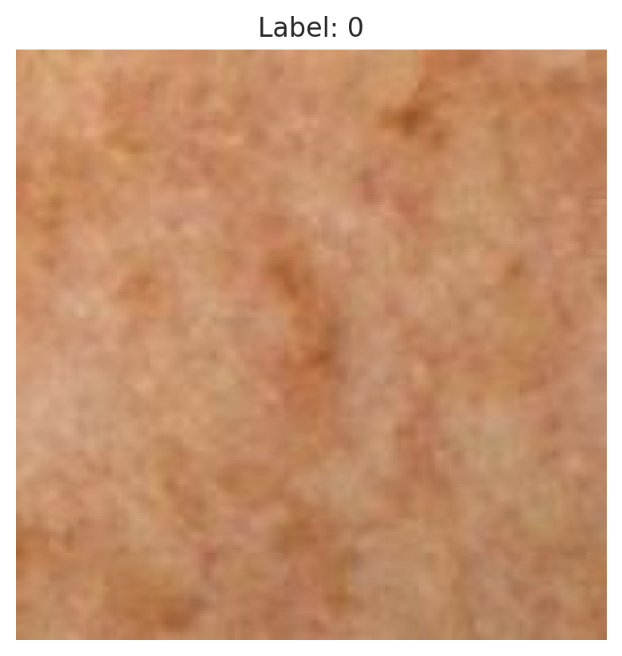
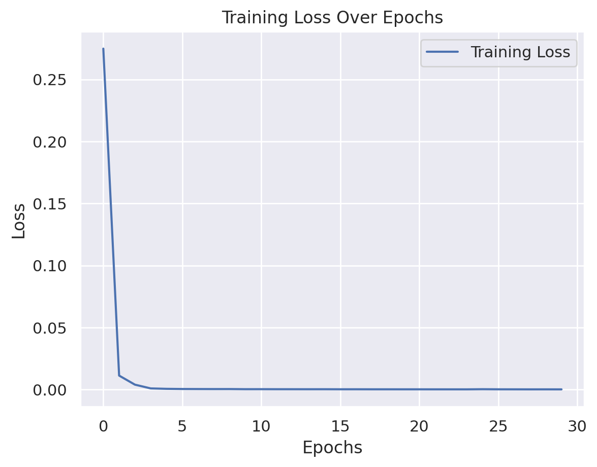

**Skin Cancer Classification (ISIC 2024 Challenge)**

This project applies Data Science, Machine learning, & Deep learning (CNNs) to classify skin lesions as benign or malignant using the ISIC 2024 Kaggle dataset
. It was Built and trained in Google Colab with TensorFlow/Keras.

📌 **Project Overview**

Implemented a Convolutional Neural Network (CNN) for binary image classification.
Dataset: Dermoscopic images of skin lesions (ISIC 2024).

📌 **Workflow**
1. Data Loading
   Loaded metadata CSV and HDF5 images from the ISIC 2024 Kaggle dataset.
   Explored dataset distribution (targets, sex, etc.).

2. Data Preprocessing & Augmentation
   Resized and normalized images.
   Applied data augmentation using Keras ImageDataGenerator and torchvision transforms.
   Handled class imbalance via undersampling non-malignant cases.

3. Custom Dataset & DataLoader
   Created a PyTorch Dataset to efficiently load images and labels.
   Split dataset into training and validation sets with stratified sampling.

4. Model Implementation
   Built EfficientNet-B0 using transfer learning (pretrained weights).
   Replaced classifier head for binary classification.

5. Training
   Trained the model with mixed precision for faster GPU performance.
   Monitored training loss and accuracy per epoch.

6. Evaluation
   Calculated accuracy, precision, recall, and F1-score.
   Visualized training curves and sample predictions.

7. Results
   Generated plots for training loss and example predictions.
   Observed model performance on balanced validation set.
### Sample Predictions

### Training Loss Curve

**⚙️ Tech Stack**

1. Programming Languages: Python.
2. Data Handling & Analysis: Pandas, NumPy.
3. Data Visualization: Matplotlib, Seaborn.
4. Machine Learning: Scikit-learn (train-test split, metrics, evaluation).
5. Deep Learning / CNNs: TensorFlow / Keras, PyTorch (EfficientNet-B0 with transfer learning)).
6. Computer Vision: OpenCV, Pillow.
7. GPU / Cloud: Google Colab with GPU support.
8. Data Augmentation: Keras ImageDataGenerator, torchvision transforms.
9. Version Control & Collaboration: Git, GitHub.
10. Other Utilities: h5py (HDF5 image storage), Imbalanced-learn (undersampling).

**📌 Project Status**

Status: Work in progress / Partially Complete

Completed:

1. Data loading and preprocessing (metadata + images)
2. Sampling and class balancing
3. Custom PyTorch Dataset & DataLoader
4. EfficientNet CNN training and evaluation
5. Visualization of training loss and example predictions

Remaining / Planned:

1. Hyperparameter tuning for better accuracy
2. Ensemble models for improved performance
3. Optional web deployment (Streamlit/Flask)
